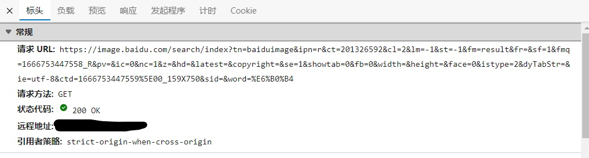
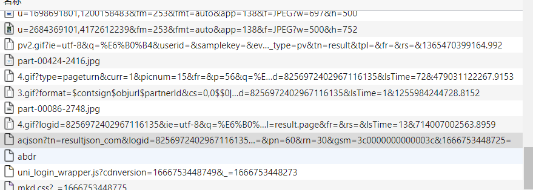
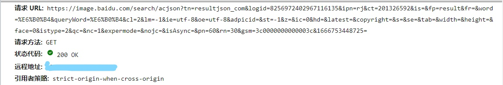
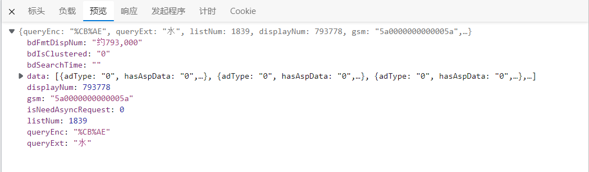
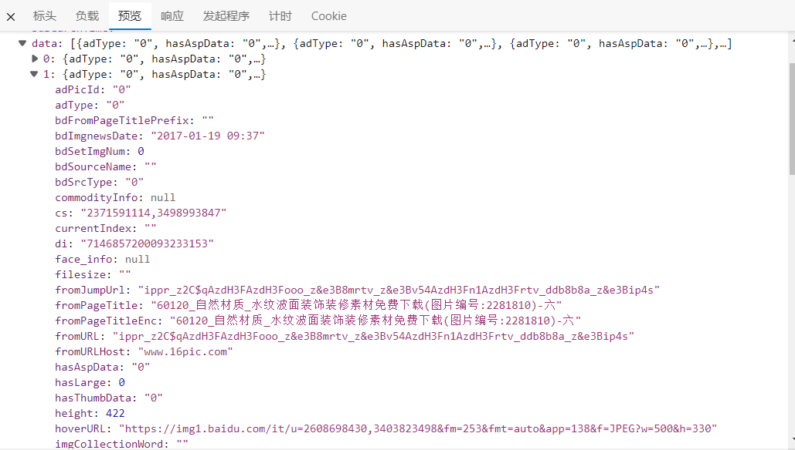
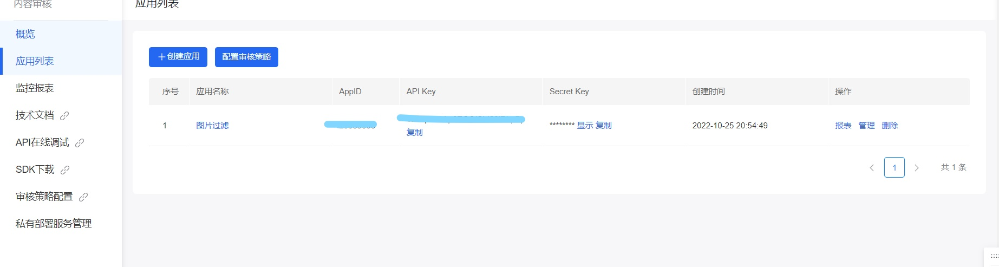
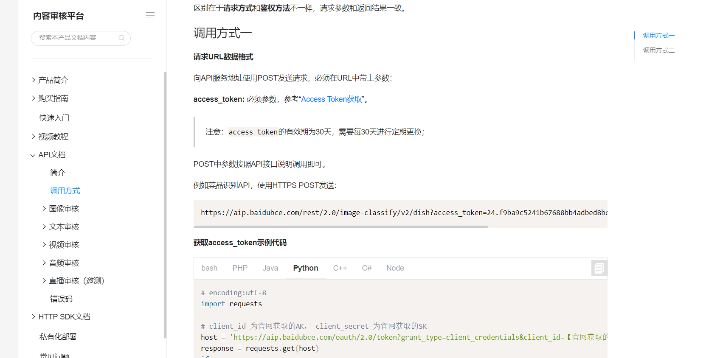
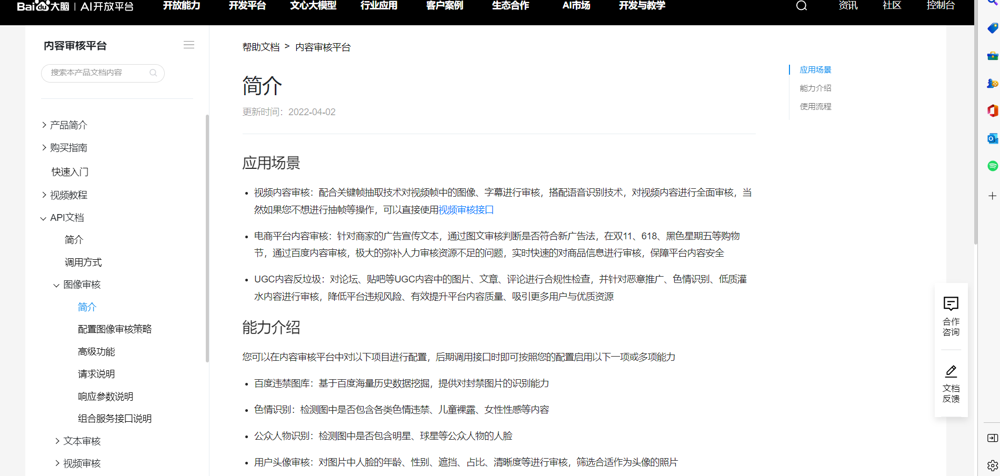

# img_spider_for_baidu
 一个爬取百度图片的爬虫并可以简单筛选

## 思路

>爬取图片的核心在于获取到对应图片的url。打开网页源代码，F12审查元素来获取指定图片在源代码的位置。可是发现源代码里根本就找不到。

>百度可能是通过js请求来获取到图片的。所以我们查找js。每个url请求的参数都可在Query String Parameters中查看。

通过观察我们可以发现以下几点：

>每一次请求的url参数，几乎都一样，只有一个参数是不同的，那就是pn，他指的是当前页面中已经展示的图片数目。
url参数的queryWord、word是搜索的关键字，对于不同关键字的搜索，这两个参数是不同的。
url参数rn指的是每次获取图片的数量，可以发现，一次请求的返回图片数量是30.
url的协议、ip、端口、目录成分为：https://image.baidu.com/search/acjson

>得到每一次的请求，我们的下一个目标就是得到每一次请求返回的30个图片的url。所以我们需要对请求的响应进行分析。可以发现它是以json的数据返回的。返回的内容最外面是一对{}，我们所要的信息在key为data中。data的值是一个大小为31的数组，其中最后一个元素是一个空字典。data的每一个元素又是一个字典，而我们需要的图片url就在key为thumbURL内。如下图所示：

>获取到图片url，这时我们就可以请求获取图片了。即requests.get(url，headers=headers).content，再将得到的图片写进文件。这里要注意的是，图片请求的请求头中一定要携带User-Agent和Referer，否则会被返回403.

## 使用百度识图筛选（可选用）

>在百度识图控制台创建一个内容审核的应用，获取到AK和SK，通过AK和SK得到token，再用token访问接口
https://ai.baidu.com/ai-doc/ANTIPORN/Jk3h6x8t2

>创建应用并配置审核策略
https://console.bce.baidu.com/

>获取token
https://ai.baidu.com/ai-doc/ANTIPORN/skk9093a1

>内容审核的介绍

